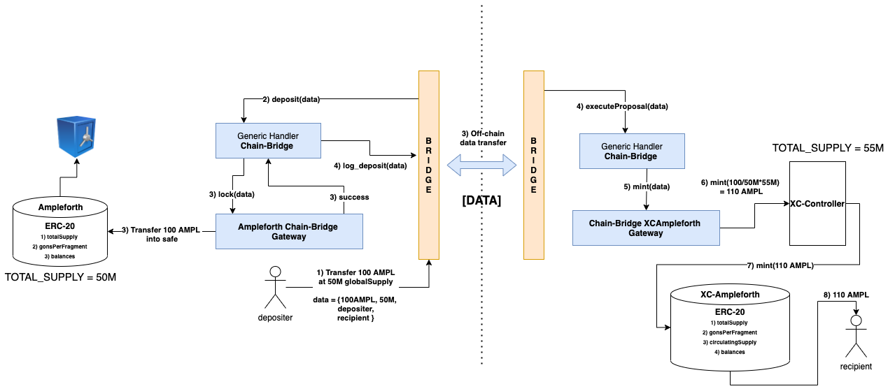

## Ampleforth-Chainbridge

Chain-Bridge secured cross-chain implementation of the Ampleforth protocol.

## Generic Chain-Bridge Architecture

Chain-Bridge realyers listen to event logs on the master chain and report it to 'other' chain. Chain-Bridge implements custom ERC20, ERC721 handlers for token transfers, and a [GenericHandler](https://github.com/ChainSafe/chainbridge-spec/blob/master/ethereum.md#generic-handler) to transmit an arbitrary piece of data between chains.

When an asset is transferred from the master-bridge to a other-bridge, It's locked in a smart contract on the master chain and equivalent denominations of a 'bridge-secured' the asset are minted in the 'other' chain.
eg) When a user transfers 10 REP from Ethereum to Tron, 10 REP is locked in the bridge contract on the Ethereum side and 10 cbREP (chain-bridge REP) are minted to the user's wallet on Tron.

## Ampleforth Bridge Architecture

AMPL is an adaptive base-money, that adjusts total supply based on supply and demand. User's AMPL balance can change up or down through a daily rebase operation. However since AMPLs are also non-dilutive, any user's AMPL share or the ratio of the user's AMPL balance to the total supply of AMPL will be constant regardless of rebasing.

### Rebase

The Ampleforth ERC-20 uses a internal scalar variable to proportionally change all users balances.  When the rebase operation occurs on the master chain, the scalar variable is updated. The updated scalar propagated through the bridge to the 'other' chain. The other chain lazily updates it's local copy of the scalar, and thus updating user's balances on the 'other' chain.

### Transfer

To guarantee rebase safe transfers between chains, we denominate transfers using 2 numbers:
1) The amount of AMPL being transfered and
2) The total supply of AMPL on the current-chain at the time of transfer

### XC-Ampleforth

Cross-Chain Ampleforth, A clone version of the Ampleforth token, policy and the orchestrator with some functional modifications deployed on the 'other' chain. They are triggered by the chain-bridge when a cross-chain event occurs.

* `XCAmpleforth.sol`: Cross-Chain Ampleforth ERC20 token is functionally identical to the Ampleforth ERC20, additionally has the ability to `mint` and `burn`. On rebase it takes in the new `totalSupply` from the master chain via the bridge and updates the scalar variable (`gonsPerFragment`).

* `XCAmpleforthPolicy.sol`: Cross-Chain Ampleforth Policy contract, acts as a controller contract with deals with white-listing bridges and propagating `mint`, `burn` and `rebase` calls to the xc-ampl token.

* `XCOrchestrator.sol`: Identical to the Ampleforth Orchestrator.

## Ampleforth-Chainbridge Architecture

Both AMPL rebases and transfers are propagated between chains through Chain-Bridge using the [GenericHandler](https://github.com/ChainSafe/chainbridge-spec/blob/master/ethereum.md#generic-handler).

### Ampleforth Chain-Bridge Gateway

`AmpleforthChainBridgeGateway.sol` is deployed on the master chain. It deals with validating data sent to and from the bridge. It also locks/unlocks AMPLs to/from a vault when a user executes a cross-chain transfer.

### Chain-Bridge XCAmpleforthPolicy Gateway

`ChainBrdigeXCAmpleforthPolicyGateway.sol` is deployed on the 'other' chain. It deals with validating data to and from the bridge. It acts as a pass-through contract between chain-bridge and the `XCAmpleforthPolicy.sol` contract.

## Integration testing

TODO!

## Reference Material

* [Introduction](https://www.notion.so/Introduction-to-ChainBridge-f1b783317e464f61909c743e1e934e99) to Chain-bridge.

* Chainbrdige solidity [spec](https://www.notion.so/ChainBridge-Solidity-ad0b0e53e5204e7c8e5e850cbd40392b).

* [Steps](https://www.notion.so/Step-by-Step-Usage-Guide-ethereum-62fc70f1c39e45a48f9079d6b027d4ca) to run Chain-bridge relayer.
